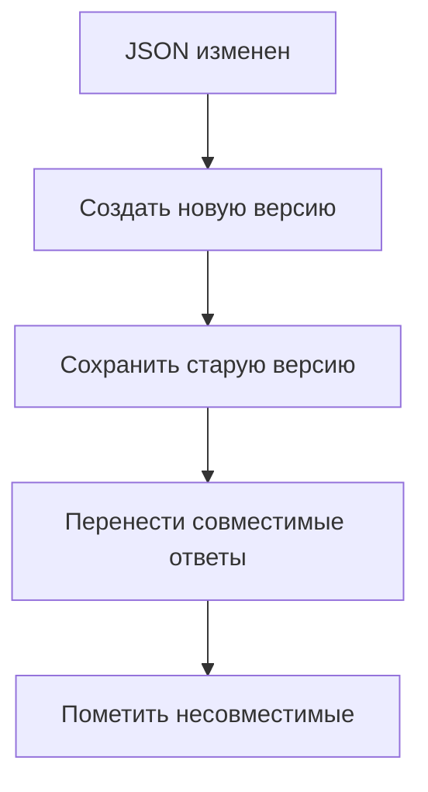
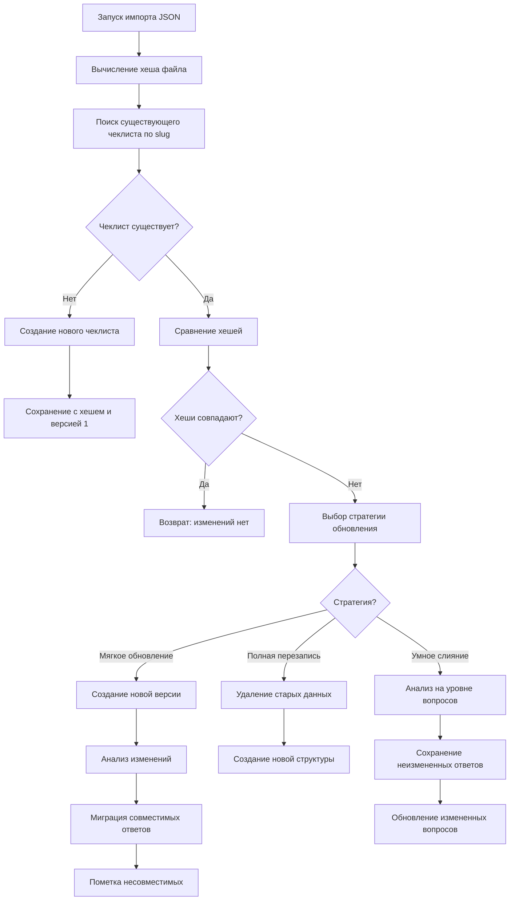

# Архитектура версионирования чеклистов

## Проблема

Текущая система импорта чеклистов не поддерживает обновление данных при изменении JSON файлов. Если чеклист уже импортирован, повторный импорт невозможен из-за проверки существования по `slug` в [`backend/app/services/checklist_service.py:57`](../backend/app/services/checklist_service.py:57).

## Анализ текущей архитектуры

### Текущий процесс импорта
1. Парсинг JSON файла через [`ChecklistJsonParser`](../../../backend/app/services/checklist_json_parser.py)
2. Проверка существования чеклиста по `slug`
3. Если существует → `ValueError("Чеклист уже существует")`
4. Если не существует → создание новой структуры

### Проблемы текущего подхода
- Невозможность обновления существующих чеклистов
- Потеря пользовательских данных при необходимости изменений
- Отсутствие отслеживания версий JSON файлов
- Нет механизма миграции данных

## Предлагаемое решение

### 1. Расширение модели данных

#### Новые поля для таблицы `checklists`

```sql
-- Миграция: добавление полей версионирования
ALTER TABLE checklists ADD COLUMN file_hash VARCHAR(64);        -- SHA-256 хеш JSON файла
ALTER TABLE checklists ADD COLUMN file_path VARCHAR(500);       -- Путь к исходному JSON файлу
ALTER TABLE checklists ADD COLUMN version INTEGER DEFAULT 1;    -- Версия чеклиста
ALTER TABLE checklists ADD COLUMN last_imported_at TIMESTAMP;   -- Время последнего импорта
ALTER TABLE checklists ADD COLUMN parent_version_id INTEGER;    -- Ссылка на предыдущую версию

-- Индексы для оптимизации
CREATE INDEX idx_checklists_file_hash ON checklists(file_hash);
CREATE INDEX idx_checklists_slug_version ON checklists(slug, version);
```

#### Новые поля для идентификации сущностей

```sql
-- Добавление external_id для точного сопоставления сущностей при обновлении
ALTER TABLE checklist_sections ADD COLUMN external_id VARCHAR(100);
ALTER TABLE checklist_subsections ADD COLUMN external_id VARCHAR(100);
ALTER TABLE checklist_question_groups ADD COLUMN external_id VARCHAR(100);
ALTER TABLE checklist_questions ADD COLUMN external_id VARCHAR(100);

-- Индексы для быстрого поиска по external_id
CREATE INDEX idx_sections_external_id ON checklist_sections(external_id);
CREATE INDEX idx_subsections_external_id ON checklist_subsections(external_id);
CREATE INDEX idx_groups_external_id ON checklist_question_groups(external_id);
CREATE INDEX idx_questions_external_id ON checklist_questions(external_id);

-- Составные индексы для уникальности в рамках родительской сущности
CREATE UNIQUE INDEX idx_sections_checklist_external_id ON checklist_sections(checklist_id, external_id) WHERE external_id IS NOT NULL;
CREATE UNIQUE INDEX idx_subsections_section_external_id ON checklist_subsections(section_id, external_id) WHERE external_id IS NOT NULL;
CREATE UNIQUE INDEX idx_groups_subsection_external_id ON checklist_question_groups(subsection_id, external_id) WHERE external_id IS NOT NULL;
CREATE UNIQUE INDEX idx_questions_group_external_id ON checklist_questions(question_group_id, external_id) WHERE external_id IS NOT NULL;
```

#### Расширение модели `ChecklistResponse`

```sql
-- Привязка ответов к версиям чеклистов
ALTER TABLE checklist_responses ADD COLUMN checklist_version INTEGER DEFAULT 1;
ALTER TABLE checklist_responses ADD COLUMN migration_status VARCHAR(20) DEFAULT 'CURRENT';

-- Возможные значения migration_status:
-- 'CURRENT'  - актуальный ответ
-- 'MIGRATED' - перенесен с предыдущей версии  
-- 'OUTDATED' - устарел, требует обновления
-- 'ORPHANED' - вопрос удален в новой версии
```

### 2. Стратегия обновления: "Мягкое обновление"

- **Принцип**: Создание новой версии с сохранением старой
- **Преимущества**:
  - Полная сохранность пользовательских данных
  - Возможность отката к предыдущим версиям
  - Постепенная миграция ответов
- **Недостатки**: Увеличение размера БД



### 3. Новые модели данных

```python
# backend/app/database/models/checklist.py

class Checklist(BaseModel):
    # ... существующие поля ...
    
    # Новые поля для версионирования
    file_hash = Column(String(64))  # SHA-256 хеш JSON файла
    file_path = Column(String(500))  # Путь к исходному файлу
    version = Column(Integer, default=1)  # Версия чеклиста
    last_imported_at = Column(DateTime)  # Время последнего импорта
    
    # Связь с предыдущими версиями
    parent_version_id = Column(Integer, ForeignKey("checklists.id"), nullable=True)
    parent_version = relationship("Checklist", remote_side=[id])

class ChecklistSection(BaseModel):
    # ... существующие поля ...
    
    # Новое поле для точной идентификации при обновлении
    external_id = Column(String(100))  # ID из JSON файла

class ChecklistSubsection(BaseModel):
    # ... существующие поля ...
    
    external_id = Column(String(100))  # ID из JSON файла

class ChecklistQuestionGroup(BaseModel):
    # ... существующие поля ...
    
    external_id = Column(String(100))  # ID из JSON файла

class ChecklistQuestion(BaseModel):
    # ... существующие поля ...
    
    external_id = Column(String(100))  # ID из JSON файла

class MigrationStatus(enum.Enum):
    CURRENT = "CURRENT"    # Актуальный ответ
    MIGRATED = "MIGRATED"  # Перенесен с предыдущей версии
    OUTDATED = "OUTDATED"  # Устарел, требует обновления
    ORPHANED = "ORPHANED"  # Вопрос удален в новой версии

class ChecklistResponse(BaseModel):
    # ... существующие поля ...
    
    # Привязка к версии чеклиста
    checklist_version = Column(Integer, default=1)
    migration_status = Column(Enum(MigrationStatus), default=MigrationStatus.CURRENT)
```

### 4. Новый сервис версионирования

```python
# backend/app/services/checklist_version_service.py

class ChecklistVersionService:
    """Сервис для управления версиями чеклистов"""
    
    def __init__(self):
        self.parser = ChecklistJsonParser()
        self.entity_matcher = EntityMatcher()
        self.migration_service = ResponseMigrationService()
    
    def calculate_file_hash(self, file_path: str) -> str:
        """Вычисляет SHA-256 хеш JSON файла"""
        import hashlib
        with open(file_path, 'rb') as f:
            return hashlib.sha256(f.read()).hexdigest()
    
    def import_or_update_checklist(
        self,
        db: Session,
        file_path: str
    ) -> ImportResult:
        """Импортирует новый или обновляет существующий чеклист (мягкое обновление)"""
        
        # 1. Вычисляем хеш файла
        file_hash = self.calculate_file_hash(file_path)
        
        # 2. Парсим структуру
        structure = self.parser.parse_file(file_path)
        
        # 3. Ищем существующий чеклист по slug (стабильный идентификатор)
        existing = checklist_crud.get_by_slug(db, structure.slug)
        
        if not existing:
            # Новый чеклист - обычный импорт
            return self.create_new_checklist(db, structure, file_path, file_hash)
        
        # 4. Проверяем изменения по хешу файла
        if existing.file_hash == file_hash:
            return ImportResult(status="NO_CHANGES", checklist=existing)
        
        # 5. Сопоставляем сущности по external_id из JSON
        match_result = self.entity_matcher.match_all_entities(existing, structure)
        
        # 6. Применяем мягкое обновление с сохранением старой версии
        return self.soft_update_with_matching(db, existing, structure, match_result, file_path, file_hash)

class EntityMatcher:
    """Сервис для сопоставления сущностей при обновлении"""
    
    def match_all_entities(self, old_checklist: Checklist, new_structure: ChecklistStructure) -> MatchResult:
        """Сопоставляет все сущности между старой и новой версией"""
        
        # Сопоставляем секции по external_id
        section_matches = self.match_sections(old_checklist.sections, new_structure.sections)
        
        # Сопоставляем подсекции, группы и вопросы
        subsection_matches = []
        group_matches = []
        question_matches = []
        
        for old_section, new_section in section_matches.matched:
            sub_matches = self.match_subsections(old_section.subsections, new_section.subsections)
            subsection_matches.extend(sub_matches.matched)
            
            for old_subsection, new_subsection in sub_matches.matched:
                grp_matches = self.match_groups(old_subsection.question_groups, new_subsection.question_groups)
                group_matches.extend(grp_matches.matched)
                
                for old_group, new_group in grp_matches.matched:
                    q_matches = self.match_questions(old_group.questions, new_group.questions)
                    question_matches.extend(q_matches.matched)
        
        return MatchResult(
            matched_sections=section_matches.matched,
            matched_subsections=subsection_matches,
            matched_groups=group_matches,
            matched_questions=question_matches,
            added_sections=section_matches.added,
            deleted_sections=section_matches.deleted
        )
    
    def match_sections(self, old_sections: List, new_sections: List) -> EntityMatchResult:
        """Сопоставляет секции по external_id"""
        return self._match_by_external_id(old_sections, new_sections, 'id')

    def _match_by_external_id(self, old_entities: List, new_entities: List, id_field: str) -> EntityMatchResult:
        """Базовый метод сопоставления по external_id"""
        
        old_by_id = {getattr(entity, 'external_id'): entity for entity in old_entities if hasattr(entity, 'external_id') and entity.external_id}
        new_by_id = {entity.get(id_field): entity for entity in new_entities if entity.get(id_field)}
        
        matched = []
        for entity_id, new_entity in new_by_id.items():
            if entity_id in old_by_id:
                matched.append((old_by_id[entity_id], new_entity))
        
        matched_old_ids = {old.external_id for old, _ in matched}
        matched_new_ids = {new.get(id_field) for _, new in matched}
        
        added = [entity for entity in new_entities if entity.get(id_field) not in matched_new_ids]
        deleted = [entity for entity in old_entities if getattr(entity, 'external_id', None) not in matched_old_ids]
        
        return EntityMatchResult(matched=matched, added=added, deleted=deleted)

class ResponseMigrationService:
    """Сервис для миграции пользовательских ответов"""
    
    def migrate_all_responses(self, match_result: MatchResult, db: Session) -> MigrationReport:
        """Мигрирует все пользовательские ответы"""
        
        migrated_count = 0
        orphaned_responses = []
        
        # Мигрируем ответы на сопоставленные вопросы
        for old_question, new_question in match_result.matched_questions:
            responses = self._get_all_responses_for_question(db, old_question.id)
            for response in responses:
                # Переносим ответ на новый вопрос (будет создан новый ID)
                response.migration_status = MigrationStatus.MIGRATED
                migrated_count += 1
        
        # Помечаем ответы на удаленные вопросы как "осиротевшие"
        for deleted_question in match_result.deleted_questions:
            responses = self._get_all_responses_for_question(db, deleted_question.id)
            for response in responses:
                response.migration_status = MigrationStatus.ORPHANED
                orphaned_responses.append(response)
        
        return MigrationReport(
            migrated_count=migrated_count,
            orphaned_count=len(orphaned_responses),
            orphaned_responses=orphaned_responses
        )

# Используется только стратегия мягкого обновления
# class UpdateStrategy(enum.Enum):
#     SOFT_UPDATE = "SOFT_UPDATE"    # Создание новой версии с сохранением старой

class ImportResult:
    def __init__(self, status: str, checklist: Checklist, migration_report: MigrationReport = None, match_result: MatchResult = None):
        self.status = status  # "CREATED", "UPDATED", "NO_CHANGES", "ERROR"
        self.checklist = checklist
        self.migration_report = migration_report
        self.match_result = match_result

class MatchResult:
    def __init__(self, matched_sections, matched_subsections, matched_groups, matched_questions, added_sections, deleted_sections):
        self.matched_sections = matched_sections
        self.matched_subsections = matched_subsections
        self.matched_groups = matched_groups
        self.matched_questions = matched_questions
        self.added_sections = added_sections
        self.deleted_sections = deleted_sections

class EntityMatchResult:
    def __init__(self, matched, added, deleted):
        self.matched = matched  # Список кортежей (old_entity, new_entity)
        self.added = added      # Список новых сущностей
        self.deleted = deleted  # Список удаленных сущностей

class MigrationReport:
    def __init__(self, migrated_count, orphaned_count, orphaned_responses):
        self.migrated_count = migrated_count
        self.orphaned_count = orphaned_count
        self.orphaned_responses = orphaned_responses
```

### 5. Модификация существующего сервиса

```python
# Изменения в backend/app/services/checklist_service.py

class ChecklistService:
    def __init__(self):
        self.parser = ChecklistJsonParser()
        self.version_service = ChecklistVersionService()  # Новый сервис
    
    def import_checklist_from_file(self, db: Session, file_path: str) -> Checklist:
        """
        Импорт чеклиста из файла с поддержкой мягкого обновления
        
        Args:
            db: Сессия базы данных
            file_path: Путь к файлу чеклиста
            
        Returns:
            Созданный или обновленный чеклист
        """
        return self.version_service.import_or_update_checklist(db, file_path)
```

### 6. Новые API эндпоинты

```python
# Дополнения к backend/app/routers/checklists.py

@router.post("/checklists/import-or-update")
async def import_or_update_checklist(
    file_path: str,
    db: Session = Depends(get_db)
):
    """Импортирует новый или обновляет существующий чеклист (мягкое обновление)"""
    result = checklist_service.import_checklist_from_file(db, file_path)
    return {
        "status": result.status,
        "checklist_id": result.checklist.id,
        "version": result.checklist.version,
        "migration_report": result.migration_report
    }

@router.get("/checklists/{slug}/versions")
async def get_checklist_versions(slug: str, db: Session = Depends(get_db)):
    """Получает все версии чеклиста"""
    versions = checklist_crud.get_versions_by_slug(db, slug)
    return [
        {
            "id": v.id,
            "version": v.version,
            "created_at": v.created_at,
            "last_imported_at": v.last_imported_at,
            "is_current": v.parent_version_id is None
        }
        for v in versions
    ]

@router.post("/checklists/{slug}/migrate-responses")
async def migrate_user_responses(
    slug: str, 
    from_version: int, 
    to_version: int,
    character_id: int,
    db: Session = Depends(get_db)
):
    """Переносит ответы пользователей между версиями"""
    migration_report = checklist_service.version_service.migrate_user_responses(
        db, slug, from_version, to_version, character_id
    )
    return migration_report

@router.get("/checklists/{slug}/changes")
async def get_version_changes(
    slug: str,
    from_version: int,
    to_version: int,
    db: Session = Depends(get_db)
):
    """Получает список изменений между версиями"""
    old_checklist = checklist_crud.get_by_slug_and_version(db, slug, from_version)
    new_checklist = checklist_crud.get_by_slug_and_version(db, slug, to_version)
    
    changes = checklist_service.version_service.detect_changes(old_checklist, new_checklist)
    return changes
```

### 7. Миграция базы данных

```python
# backend/alembic/versions/xxx_add_checklist_versioning.py

"""add_checklist_versioning

Revision ID: xxx
Revises: 7b07d6908d09
Create Date: 2025-08-12 15:00:00.000000
"""

from alembic import op
import sqlalchemy as sa

def upgrade() -> None:
    # Добавляем поля версионирования в checklists
    op.add_column('checklists', sa.Column('file_hash', sa.String(64), nullable=True))
    op.add_column('checklists', sa.Column('file_path', sa.String(500), nullable=True))
    op.add_column('checklists', sa.Column('version', sa.Integer(), default=1, nullable=False))
    op.add_column('checklists', sa.Column('last_imported_at', sa.DateTime(), nullable=True))
    op.add_column('checklists', sa.Column('parent_version_id', sa.Integer(), nullable=True))
    
    # Добавляем external_id для точного сопоставления сущностей
    op.add_column('checklist_sections', sa.Column('external_id', sa.String(100), nullable=True))
    op.add_column('checklist_subsections', sa.Column('external_id', sa.String(100), nullable=True))
    op.add_column('checklist_question_groups', sa.Column('external_id', sa.String(100), nullable=True))
    op.add_column('checklist_questions', sa.Column('external_id', sa.String(100), nullable=True))
    
    # Добавляем поля миграции в checklist_responses
    op.add_column('checklist_responses', sa.Column('checklist_version', sa.Integer(), default=1, nullable=False))
    op.add_column('checklist_responses', sa.Column('migration_status', sa.String(20), default='CURRENT', nullable=False))
    
    # Создаем внешний ключ для parent_version_id
    op.create_foreign_key(
        'fk_checklist_parent_version',
        'checklists', 'checklists',
        ['parent_version_id'], ['id']
    )
    
    # Создаем индексы для оптимизации
    op.create_index('idx_checklists_file_hash', 'checklists', ['file_hash'])
    op.create_index('idx_checklists_slug_version', 'checklists', ['slug', 'version'])
    op.create_index('idx_responses_migration_status', 'checklist_responses', ['migration_status'])
    
    # Индексы для быстрого поиска по external_id
    op.create_index('idx_sections_external_id', 'checklist_sections', ['external_id'])
    op.create_index('idx_subsections_external_id', 'checklist_subsections', ['external_id'])
    op.create_index('idx_groups_external_id', 'checklist_question_groups', ['external_id'])
    op.create_index('idx_questions_external_id', 'checklist_questions', ['external_id'])
    
    # Составные индексы для уникальности в рамках родительской сущности
    op.create_index('idx_sections_checklist_external_id', 'checklist_sections', ['checklist_id', 'external_id'],
                   postgresql_where=sa.text('external_id IS NOT NULL'), unique=True)
    op.create_index('idx_subsections_section_external_id', 'checklist_subsections', ['section_id', 'external_id'],
                   postgresql_where=sa.text('external_id IS NOT NULL'), unique=True)
    op.create_index('idx_groups_subsection_external_id', 'checklist_question_groups', ['subsection_id', 'external_id'],
                   postgresql_where=sa.text('external_id IS NOT NULL'), unique=True)
    op.create_index('idx_questions_group_external_id', 'checklist_questions', ['question_group_id', 'external_id'],
                   postgresql_where=sa.text('external_id IS NOT NULL'), unique=True)

def downgrade() -> None:
    # Удаляем составные индексы
    op.drop_index('idx_questions_group_external_id', 'checklist_questions')
    op.drop_index('idx_groups_subsection_external_id', 'checklist_question_groups')
    op.drop_index('idx_subsections_section_external_id', 'checklist_subsections')
    op.drop_index('idx_sections_checklist_external_id', 'checklist_sections')
    
    # Удаляем индексы external_id
    op.drop_index('idx_questions_external_id', 'checklist_questions')
    op.drop_index('idx_groups_external_id', 'checklist_question_groups')
    op.drop_index('idx_subsections_external_id', 'checklist_subsections')
    op.drop_index('idx_sections_external_id', 'checklist_sections')
    
    # Удаляем остальные индексы
    op.drop_index('idx_responses_migration_status', 'checklist_responses')
    op.drop_index('idx_checklists_slug_version', 'checklists')
    op.drop_index('idx_checklists_file_hash', 'checklists')
    
    # Удаляем внешний ключ
    op.drop_constraint('fk_checklist_parent_version', 'checklists', type_='foreignkey')
    
    # Удаляем столбцы
    op.drop_column('checklist_responses', 'migration_status')
    op.drop_column('checklist_responses', 'checklist_version')
    op.drop_column('checklist_questions', 'external_id')
    op.drop_column('checklist_question_groups', 'external_id')
    op.drop_column('checklist_subsections', 'external_id')
    op.drop_column('checklist_sections', 'external_id')
    op.drop_column('checklists', 'parent_version_id')
    op.drop_column('checklists', 'last_imported_at')
    op.drop_column('checklists', 'version')
    op.drop_column('checklists', 'file_path')
    op.drop_column('checklists', 'file_hash')
```

## Алгоритм работы системы

### Схема процесса обновления



## Преимущества решения

### 1. Сохранность данных
- Пользовательские ответы не теряются при обновлениях
- Возможность отката к предыдущим версиям
- История изменений чеклистов

### 2. Гибкость
- Выбор стратегии обновления под конкретные нужды
- Поддержка различных сценариев изменений
- Возможность миграции данных между версиями

### 3. Автоматизация
- Автоматическое определение изменений в JSON
- Умная миграция пользовательских данных
- Минимальное вмешательство администратора

### 4. Безопасность
- Контролируемый процесс обновления
- Возможность предварительного просмотра изменений
- Откат при проблемах

## Риски и ограничения

### 1. Увеличение сложности
- Более сложная логика импорта
- Необходимость обучения пользователей
- Дополнительное тестирование

### 2. Размер базы данных
- Хранение нескольких версий чеклистов
- Увеличение объема данных
- Необходимость периодической очистки старых версий

### 3. Производительность
- Дополнительные запросы при работе с версиями
- Сложность запросов для получения актуальных данных
- Необходимость оптимизации индексов

## План внедрения

### Этап 1: Подготовка
- [ ] Создание миграции базы данных
- [ ] Разработка новых моделей
- [ ] Написание тестов

### Этап 2: Разработка сервисов
- [ ] Реализация `ChecklistVersionService`
- [ ] Модификация `ChecklistService`
- [ ] Создание алгоритмов миграции

### Этап 3: API и интеграция
- [ ] Новые эндпоинты для работы с версиями
- [ ] Обновление существующих API
- [ ] Интеграция с фронтендом

### Этап 4: Тестирование и развертывание
- [ ] Комплексное тестирование
- [ ] Миграция существующих данных
- [ ] Развертывание в продакшн

## Заключение

Предлагаемая архитектура решает основную проблему невозможности обновления чеклистов, сохраняя при этом пользовательские данные и обеспечивая гибкость в управлении версиями. Система позволяет:

1. **Безопасно обновлять** чеклисты без потери данных
2. **Отслеживать изменения** в JSON файлах автоматически  
3. **Мигрировать данные** между версиями интеллектуально
4. **Откатываться** к предыдущим версиям при необходимости

Рекомендуется начать внедрение с **мягкого обновления** как наиболее безопасной стратегии, постепенно добавляя более сложные алгоритмы миграции по мере необходимости.
