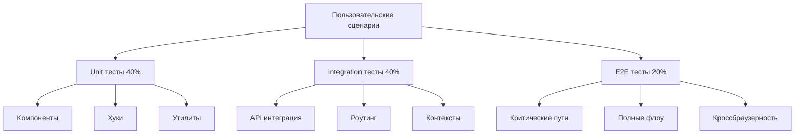

# 🧪 Комплексная стратегия тестирования фронтенда

## Обзор стратегии

Данная стратегия покрывает **все клиентские сценарии** с использованием многоуровневого подхода к тестированию:



## 🛠️ Инструменты тестирования

### Уже настроенные ✅
- **Vitest 0.34.6** - основной тестовый фреймворк
- **React Testing Library 13.4.0** - тестирование компонентов
- **MSW 1.3.2** - мокирование API
- **@testing-library/jest-dom 6.4.2** - DOM матчеры
- **@faker-js/faker 8.4.1** - генерация тестовых данных

### Требуется добавить 📦
- **@playwright/test** - E2E тестирование
- **@testing-library/react-hooks** - тестирование хуков
- **@axe-core/playwright** - accessibility тесты
- **@storybook/test-runner** - visual regression тесты

## 📋 Детальный план реализации

### Фаза 1: Настройка E2E тестирования (Приоритет: Критический)

#### 1.1 Установка и настройка Playwright
```bash
npm install -D @playwright/test @axe-core/playwright
npx playwright install
```

#### 1.2 Конфигурация Playwright
**Файл: `playwright.config.ts`**
```typescript
import { defineConfig, devices } from '@playwright/test'

export default defineConfig({
  testDir: './src/tests/e2e',
  fullyParallel: true,
  forbidOnly: !!process.env.CI,
  retries: process.env.CI ? 2 : 0,
  workers: process.env.CI ? 1 : undefined,
  reporter: 'html',
  use: {
    baseURL: 'http://localhost:5173',
    trace: 'on-first-retry',
    screenshot: 'only-on-failure',
  },
  projects: [
    {
      name: 'chromium',
      use: { ...devices['Desktop Chrome'] },
    },
    {
      name: 'firefox',
      use: { ...devices['Desktop Firefox'] },
    },
    {
      name: 'webkit',
      use: { ...devices['Desktop Safari'] },
    },
    {
      name: 'mobile',
      use: { ...devices['iPhone 13'] },
    },
  ],
  webServer: {
    command: 'npm run dev',
    url: 'http://localhost:5173',
    reuseExistingServer: !process.env.CI,
  },
})
```

#### 1.3 Базовые E2E утилиты
**Файл: `src/tests/e2e/utils/test-helpers.ts`**
```typescript
import { Page, expect } from '@playwright/test'

export class TestHelpers {
  constructor(private page: Page) {}

  async login(email: string = 'test@example.com', password: string = 'password123') {
    await this.page.goto('/')
    await this.page.click('[data-testid="auth-button"]')
    await this.page.fill('[data-testid="email-input"]', email)
    await this.page.fill('[data-testid="password-input"]', password)
    await this.page.click('[data-testid="login-submit"]')
    await expect(this.page.locator('[data-testid="user-menu"]')).toBeVisible()
  }

  async createProject(name: string, description: string = '') {
    await this.page.click('[data-testid="create-project-button"]')
    await this.page.fill('[data-testid="project-name-input"]', name)
    if (description) {
      await this.page.fill('[data-testid="project-description-input"]', description)
    }
    await this.page.click('[data-testid="create-project-submit"]')
  }

  async uploadFile(filePath: string) {
    const fileInput = this.page.locator('input[type="file"]')
    await fileInput.setInputFiles(filePath)
    await this.page.click('[data-testid="upload-submit"]')
  }
}
```

### Фаза 2: E2E тесты критических сценариев

#### 2.1 Тесты аутентификации
**Файл: `src/tests/e2e/auth.spec.ts`**
```typescript
import { test, expect } from '@playwright/test'
import { TestHelpers } from './utils/test-helpers'

test.describe('Аутентификация', () => {
  test('Полный цикл регистрации и входа', async ({ page }) => {
    const helpers = new TestHelpers(page)
    
    // Регистрация
    await page.goto('/')
    await page.click('[data-testid="auth-button"]')
    await page.click('[data-testid="switch-to-register"]')
    
    await page.fill('[data-testid="username-input"]', 'testuser')
    await page.fill('[data-testid="email-input"]', 'test@example.com')
    await page.fill('[data-testid="password-input"]', 'SecurePass123!')
    await page.click('[data-testid="register-submit"]')
    
    // Проверка автоматического входа
    await expect(page.locator('[data-testid="user-menu"]')).toBeVisible()
    
    // Выход
    await page.click('[data-testid="user-menu"]')
    await page.click('[data-testid="logout-button"]')
    await expect(page.locator('[data-testid="auth-button"]')).toBeVisible()
    
    // Повторный вход
    await helpers.login('test@example.com', 'SecurePass123!')
  })

  test('Обработка ошибок входа', async ({ page }) => {
    await page.goto('/')
    await page.click('[data-testid="auth-button"]')
    
    // Неверные данные
    await page.fill('[data-testid="email-input"]', 'wrong@example.com')
    await page.fill('[data-testid="password-input"]', 'wrongpassword')
    await page.click('[data-testid="login-submit"]')
    
    await expect(page.locator('[data-testid="error-message"]')).toBeVisible()
  })
})
```

#### 2.2 Тесты управления проектами
**Файл: `src/tests/e2e/projects.spec.ts`**
```typescript
import { test, expect } from '@playwright/test'
import { TestHelpers } from './utils/test-helpers'

test.describe('Управление проектами', () => {
  let helpers: TestHelpers

  test.beforeEach(async ({ page }) => {
    helpers = new TestHelpers(page)
    await helpers.login()
  })

  test('Создание и просмотр проекта', async ({ page }) => {
    const projectName = `Тестовый проект ${Date.now()}`
    
    // Создание проекта
    await helpers.createProject(projectName, 'Описание тестового проекта')
    
    // Проверка перенаправления на страницу проекта
    await expect(page.locator('h1')).toContainText(projectName)
    
    // Возврат к списку проектов
    await page.click('[data-testid="back-to-projects"]')
    
    // Проверка наличия проекта в списке
    await expect(page.locator(`text=${projectName}`)).toBeVisible()
  })

  test('Поиск и фильтрация проектов', async ({ page }) => {
    await page.goto('/')
    
    // Поиск
    await page.fill('[data-testid="search-input"]', 'Тестовый')
    await expect(page.locator('[data-testid="project-card"]')).toHaveCount(1)
    
    // Фильтрация
    await page.selectOption('[data-testid="filter-select"]', 'В работе')
    await expect(page.locator('[data-testid="project-card"]')).toBeVisible()
  })

  test('Удаление проекта', async ({ page }) => {
    // Создаем проект для удаления
    const projectName = `Проект для удаления ${Date.now()}`
    await helpers.createProject(projectName)
    
    // Удаляем проект
    await page.click('[data-testid="delete-project-button"]')
    await page.click('[data-testid="confirm-delete"]')
    
    // Проверяем перенаправление на список
    await expect(page).toHaveURL('/')
    
    // Проверяем отсутствие проекта в списке
    await expect(page.locator(`text=${projectName}`)).not.toBeVisible()
  })
})
```

#### 2.3 Тесты работы с текстами и персонажами
**Файл: `src/tests/e2e/texts-and-characters.spec.ts`**
```typescript
import { test, expect } from '@playwright/test'
import { TestHelpers } from './utils/test-helpers'
import path from 'path'

test.describe('Работа с текстами и персонажами', () => {
  let helpers: TestHelpers

  test.beforeEach(async ({ page }) => {
    helpers = new TestHelpers(page)
    await helpers.login()
    await helpers.createProject('Проект для тестирования текстов')
  })

  test('Загрузка и обработка текста', async ({ page }) => {
    // Загрузка файла
    const testFilePath = path.join(__dirname, 'fixtures', 'test-text.txt')
    await helpers.uploadFile(testFilePath)
    
    // Ожидание обработки
    await expect(page.locator('[data-testid="processing-indicator"]')).toBeVisible()
    await expect(page.locator('[data-testid="processed-text"]')).toBeVisible({ timeout: 30000 })
    
    // Проверка найденных персонажей
    await expect(page.locator('[data-testid="character-item"]')).toHaveCount.greaterThan(0)
  })

  test('Переход к анализу персонажа', async ({ page }) => {
    // Предполагаем, что текст уже загружен и обработан
    await page.click('[data-testid="character-item"]')
    
    // Проверка перехода к чек-листам
    await expect(page).toHaveURL(/\/characters\/\d+\/checklists/)
    await expect(page.locator('[data-testid="checklists-overview"]')).toBeVisible()
  })
})
```

#### 2.4 Тесты работы с чек-листами
**Файл: `src/tests/e2e/checklists.spec.ts`**
```typescript
import { test, expect } from '@playwright/test'
import { TestHelpers } from './utils/test-helpers'

test.describe('Работа с чек-листами', () => {
  let helpers: TestHelpers

  test.beforeEach(async ({ page }) => {
    helpers = new TestHelpers(page)
    await helpers.login()
    // Предполагаем наличие проекта с персонажем
    await page.goto('/characters/1/checklists')
  })

  test('Навигация по чек-листам', async ({ page }) => {
    // Проверка отображения обзора
    await expect(page.locator('[data-testid="checklists-overview"]')).toBeVisible()
    await expect(page.locator('[data-testid="overall-progress"]')).toBeVisible()
    
    // Переключение чек-листа
    await page.click('[data-testid="checklist-switcher"]')
    await page.click('[data-testid="checklist-option"]:first-child')
    
    // Переход к детальному просмотру
    await page.click('[data-testid="checklist-item"]:first-child')
    await expect(page).toHaveURL(/\/checklists\/[^\/]+$/)
  })

  test('Заполнение вопросов чек-листа', async ({ page }) => {
    // Переход к первому вопросу
    await page.click('[data-testid="checklist-item"]:first-child')
    
    // Текстовый вопрос
    await page.fill('[data-testid="answer-textarea"]', 'Тестовый ответ на вопрос')
    await page.fill('[data-testid="comment-textarea"]', 'Комментарий к ответу')
    await page.click('[data-testid="save-button"]')
    
    // Проверка сохранения
    await expect(page.locator('[data-testid="save-status"]')).toContainText('Сохранено')
    
    // Переход к следующему вопросу
    await page.click('[data-testid="next-question"]')
    
    // Вопрос с выбором
    await page.click('[data-testid="radio-option"]:first-child')
    
    // Автосохранение должно сработать
    await expect(page.locator('[data-testid="save-status"]')).toContainText('Сохранено')
  })

  test('Навигация по вопросам', async ({ page }) => {
    await page.click('[data-testid="checklist-item"]:first-child')
    
    // Открытие боковой панели
    await page.click('[data-testid="toggle-sidebar"]')
    await expect(page.locator('[data-testid="navigation-sidebar"]')).toBeVisible()
    
    // Поиск вопросов
    await page.fill('[data-testid="search-questions"]', 'внешность')
    await expect(page.locator('[data-testid="question-link"]')).toHaveCount.greaterThan(0)
    
    // Фильтрация неотвеченных
    await page.click('[data-testid="filter-unanswered"]')
    
    // Переход к конкретному вопросу
    await page.click('[data-testid="question-link"]:first-child')
    await expect(page.locator('[data-testid="question-card"]')).toBeVisible()
    
    // Добавление закладки
    await page.click('[data-testid="bookmark-question"]')
    await expect(page.locator('[data-testid="bookmark-indicator"]')).toBeVisible()
  })

  test('Клавиатурная навигация', async ({ page }) => {
    await page.click('[data-testid="checklist-item"]:first-child')
    
    // Навигация стрелками
    await page.keyboard.press('ArrowRight')
    await expect(page.locator('[data-testid="question-card"]')).toBeVisible()
    
    await page.keyboard.press('ArrowLeft')
    await expect(page.locator('[data-testid="question-card"]')).toBeVisible()
    
    // Быстрые переходы
    await page.keyboard.press('Home')
    await page.keyboard.press('End')
    
    // Сохранение
    await page.keyboard.press('Control+S')
  })
})
```

#### 2.5 Тесты экспорта
**Файл: `src/tests/e2e/export.spec.ts`**
```typescript
import { test, expect } from '@playwright/test'
import { TestHelpers } from './utils/test-helpers'

test.describe('Экспорт данных', () => {
  let helpers: TestHelpers

  test.beforeEach(async ({ page }) => {
    helpers = new TestHelpers(page)
    await helpers.login()
    await page.goto('/characters/1/checklists')
  })

  test('Экспорт в PDF', async ({ page }) => {
    // Открытие диалога экспорта
    await page.click('[data-testid="export-button"]')
    await expect(page.locator('[data-testid="export-dialog"]')).toBeVisible()
    
    // Выбор формата PDF
    await page.click('[data-testid="format-pdf"]')
    
    // Выбор типа отчета
    await page.click('[data-testid="report-detailed"]')
    
    // Дополнительные опции
    await page.check('[data-testid="include-comments"]')
    
    // Запуск экспорта
    const downloadPromise = page.waitForEvent('download')
    await page.click('[data-testid="export-submit"]')
    
    // Проверка скачивания
    const download = await downloadPromise
    expect(download.suggestedFilename()).toMatch(/\.pdf$/)
  })

  test('Экспорт в DOCX', async ({ page }) => {
    await page.click('[data-testid="export-button"]')
    
    // Выбор DOCX и краткого отчета
    await page.click('[data-testid="format-docx"]')
    await page.click('[data-testid="report-summary"]')
    
    const downloadPromise = page.waitForEvent('download')
    await page.click('[data-testid="export-submit"]')
    
    const download = await downloadPromise
    expect(download.suggestedFilename()).toMatch(/\.docx$/)
  })

  test('Обработка ошибок экспорта', async ({ page }) => {
    // Мокируем ошибку сервера
    await page.route('**/api/export/**', route => {
      route.fulfill({ status: 500, body: 'Server Error' })
    })
    
    await page.click('[data-testid="export-button"]')
    await page.click('[data-testid="format-pdf"]')
    await page.click('[data-testid="export-submit"]')
    
    // Проверка отображения ошибки
    await expect(page.locator('[data-testid="error-message"]')).toBeVisible()
  })
})
```

### Фаза 3: Расширение Unit и Integration тестов

#### 3.1 Недостающие компоненты для unit тестирования
```typescript
// Список компонентов, требующих тестирования:
- ChecklistGroup ❌
- ChecklistsOverview ❌  
- ChecklistSwitcher ❌
- ExportDialog ❌
- NavigationSidebar ❌
- OverallProgress ❌
- ProgressBar ❌
- QuestionFlow ❌
- QuestionNavigation ❌
- Header ❌
- ChangePasswordForm ❌
- CharacterAnalysis ❌
```

#### 3.2 Пример теста для ChecklistGroup
**Файл: `src/tests/components/checklists/ChecklistGroup.test.tsx`**
```typescript
import { describe, it, expect, vi } from 'vitest'
import { render, screen } from '../../utils/test-utils'
import { ChecklistGroup } from '../../../components/checklists/ChecklistGroup'
import { createMockChecklist } from '../../utils/mock-data'

describe('ChecklistGroup', () => {
  const mockProps = {
    title: 'Физический портрет',
    checklists: [
      createMockChecklist({ title: 'Основные черты', progress: 75 }),
      createMockChecklist({ title: 'Детали внешности', progress: 50 })
    ],
    characterId: 1,
    isUnlocked: true
  }

  it('отображает заголовок группы', () => {
    render(<ChecklistGroup {...mockProps} />)
    expect(screen.getByText('Физический портрет')).toBeInTheDocument()
  })

  it('отображает прогресс группы', () => {
    render(<ChecklistGroup {...mockProps} />)
    // Средний прогресс: (75 + 50) / 2 = 62.5%
    expect(screen.getByText('62%')).toBeInTheDocument()
  })

  it('блокирует недоступные группы', () => {
    render(<ChecklistGroup {...mockProps} isUnlocked={false} />)
    expect(screen.getByTestId('locked-group')).toBeInTheDocument()
  })

  it('обрабатывает клик по чек-листу', async () => {
    const user = userEvent.setup()
    render(<ChecklistGroup {...mockProps} />)
    
    const checklistLink = screen.getByText('Основные черты')
    await user.click(checklistLink)
    
    // Проверяем навигацию (через мок роутера)
    expect(mockNavigate).toHaveBeenCalledWith('/characters/1/checklists/osnovnye-cherty')
  })
})
```

#### 3.3 Integration тесты страниц
**Файл: `src/tests/pages/CreateProject.test.tsx`**
```typescript
import { describe, it, expect, vi } from 'vitest'
import { render, screen, waitFor } from '../utils/test-utils'
import userEvent from '@testing-library/user-event'
import CreateProject from '../../pages/CreateProject'

describe('CreateProject Page', () => {
  it('создает новый проект', async () => {
    const user = userEvent.setup()
    render(<CreateProject />)
    
    // Заполнение формы
    await user.type(screen.getByLabelText(/название/i), 'Новый проект')
    await user.type(screen.getByLabelText(/описание/i), 'Описание проекта')
    
    // Отправка формы
    await user.click(screen.getByRole('button', { name: /создать/i }))
    
    // Проверка API вызова
    await waitFor(() => {
      expect(mockCreateProject).toHaveBeenCalledWith({
        title: 'Новый проект',
        description: 'Описание проекта'
      })
    })
    
    // Проверка перенаправления
    expect(mockNavigate).toHaveBeenCalledWith('/projects/123')
  })

  it('обрабатывает ошибки валидации', async () => {
    const user = userEvent.setup()
    render(<CreateProject />)
    
    // Попытка создать без названия
    await user.click(screen.getByRole('button', { name: /создать/i }))
    
    expect(screen.getByText(/название обязательно/i)).toBeInTheDocument()
  })
})
```

### Фаза 4: Accessibility и Performance тесты

#### 4.1 Accessibility тесты
**Файл: `src/tests/e2e/accessibility.spec.ts`**
```typescript
import { test, expect } from '@playwright/test'
import AxeBuilder from '@axe-core/playwright'

test.describe('Accessibility', () => {
  test('главная страница соответствует WCAG', async ({ page }) => {
    await page.goto('/')
    
    const accessibilityScanResults = await new AxeBuilder({ page }).analyze()
    expect(accessibilityScanResults.violations).toEqual([])
  })

  test('страница чек-листа доступна', async ({ page }) => {
    // Логин и переход к чек-листу
    await page.goto('/characters/1/checklists/physical-portrait')
    
    const accessibilityScanResults = await new AxeBuilder({ page })
      .withTags(['wcag2a', 'wcag2aa'])
      .analyze()
    
    expect(accessibilityScanResults.violations).toEqual([])
  })

  test('клавиатурная навигация работает', async ({ page }) => {
    await page.goto('/characters/1/checklists/physical-portrait')
    
    // Навигация только клавиатурой
    await page.keyboard.press('Tab')
    await page.keyboard.press('Tab')
    await page.keyboard.press('Enter')
    
    // Проверка фокуса
    const focusedElement = await page.locator(':focus')
    await expect(focusedElement).toBeVisible()
  })
})
```

### Фаза 5: CI/CD интеграция

#### 5.1 GitHub Actions workflow
**Файл: `.github/workflows/frontend-e2e-tests.yml`**
```yaml
name: Frontend E2E Tests

on:
  push:
    branches: [ main, develop ]
  pull_request:
    branches: [ main ]

jobs:
  e2e-tests:
    timeout-minutes: 60
    runs-on: ubuntu-latest
    
    steps:
    - uses: actions/checkout@v4
    
    - uses: actions/setup-node@v4
      with:
        node-version: '18'
        cache: 'npm'
        cache-dependency-path: frontend/package-lock.json
    
    - name: Install dependencies
      working-directory: ./frontend
      run: npm ci
    
    - name: Install Playwright Browsers
      working-directory: ./frontend
      run: npx playwright install --with-deps
    
    - name: Run unit tests
      working-directory: ./frontend
      run: npm run test:run
    
    - name: Build frontend
      working-directory: ./frontend
      run: npm run build
    
    - name: Run E2E tests
      working-directory: ./frontend
      run: npm run test:e2e
    
    - uses: actions/upload-artifact@v4
      if: always()
      with:
        name: playwright-report
        path: frontend/playwright-report/
        retention-days: 30
    
    - name: Upload coverage reports
      uses: codecov/codecov-action@v3
      with:
        file: ./frontend/coverage/lcov.info
        flags: frontend
```

#### 5.2 Обновление package.json
```json
{
  "scripts": {
    "test:e2e": "playwright test",
    "test:e2e:ui": "playwright test --ui",
    "test:e2e:debug": "playwright test --debug",
    "test:all": "npm run test:run && npm run test:e2e"
  }
}
```

## 📊 Метрики и отчетность

### Целевые показатели покрытия
- **Unit тесты**: 90% покрытие компонентов
- **Integration тесты**: 85% покрытие страниц
- **E2E тесты**: 100% критических сценариев
- **Accessibility**: 0 нарушений WCAG 2.1 AA

### Автоматические отчеты
1. **Coverage отчеты** - генерируются после каждого запуска
2. **E2E отчеты** - HTML отчеты Playwright
3. **Accessibility отчеты** - результаты axe-core
4. **Performance метрики** - время выполнения тестов

## 🚀 План внедрения

### Неделя 1: Настройка инфраструктуры
- [ ] Установка и настройка Playwright
- [ ] Создание базовых E2E утилит
- [ ] Настройка CI/CD pipeline

### Неделя 2: Критические E2E тесты
- [ ] Тесты аутентификации
- [ ] Тесты управления проектами
- [ ] Тесты загрузки текстов

### Неделя 3: Основные E2E тесты
- [ ] Тесты работы с чек-листами
- [ ] Тесты навигации
- [ ] Тесты экспорта

### Неделя 4: Unit тесты компонентов
- [ ] Тестирование всех checklist компонентов
- [ ] Тестирование auth компонентов
- [ ] Тестирование утилит

### Неделя 5: Integration тесты
- [ ] Тестирование страниц
- [ ] Тестирование API интеграции
- [ ] Тестирование роутинга

### Неделя 6: Специализированные тесты
- [ ] Accessibility тесты
- [ ] Performance тесты
- [ ] Edge cases и обработка ошибок

## 🎯 Ожидаемые результаты

После реализации данной стратегии проект будет иметь:

✅ **100% покрытие критических пользовательских сценариев**  
✅ **Автоматическое тестирование на каждый PR**  
✅ **Кроссбраузерное тестирование**  
✅ **Accessibility compliance**  
✅ **Быстрая обратная связь для разработчиков**  
✅ **Высокое качество и стабильность приложения**

Это обеспечит надежность всех клиентских сценариев и позволит уверенно развивать функциональность приложения.