```mermaid
erDiagram
    User ||--o{ Project : creates
    User ||--o{ UserToken : has
    Project ||--o{ Text : contains
    Text ||--o{ Character : has
    Character ||--o{ ChecklistResponse : fills
    
    Checklist ||--o{ ChecklistSection : contains
    ChecklistSection ||--o{ ChecklistSubsection : contains
    ChecklistSubsection ||--o{ ChecklistQuestionGroup : contains
    ChecklistQuestionGroup ||--o{ ChecklistQuestion : contains
    ChecklistQuestion ||--o{ ChecklistAnswer : has
    ChecklistQuestion ||--o{ ChecklistResponse : answered_by
    ChecklistAnswer ||--o{ ChecklistResponse : selected_in
    ChecklistResponse ||--o{ ChecklistResponseHistory : tracks
    
    User {
        int id PK
        string email UK
        string username UK
        string password_hash
        string full_name
        boolean is_active
        datetime created_at
        datetime updated_at
    }
    
    UserToken {
        int id PK
        int user_id FK
        string token_hash
        string token_type
        datetime expires_at
        boolean is_revoked
        datetime created_at
    }
    
    Project {
        int id PK
        int user_id FK
        string title
        text description
        datetime created_at
        datetime updated_at
    }
    
    Text {
        int id PK
        int project_id FK
        string filename
        string original_format
        text content
        json metadata
        datetime processed_at
        datetime created_at
    }
    
    Character {
        int id PK
        int text_id FK
        string name
        json aliases
        float importance_score
        json speech_attribution
        string gender
        datetime created_at
        datetime updated_at
    }
    
    Checklist {
        int id PK
        string external_id UK
        string title
        text description
        string slug UK
        string icon
        int order_index
        text goal
        string file_hash
        string version
        boolean is_active
        datetime created_at
        datetime updated_at
    }
    
    ChecklistSection {
        int id PK
        int checklist_id FK
        string external_id
        string title
        string number
        string icon
        int order_index
        datetime created_at
        datetime updated_at
    }
    
    ChecklistSubsection {
        int id PK
        int section_id FK
        string external_id
        string title
        string number
        int order_index
        text examples
        text why_important
        datetime created_at
        datetime updated_at
    }
    
    ChecklistQuestionGroup {
        int id PK
        int subsection_id FK
        string external_id
        string title
        int order_index
        datetime created_at
        datetime updated_at
    }
    
    ChecklistQuestion {
        int id PK
        int question_group_id FK
        string external_id
        text text
        int order_index
        string answer_type
        string source_type
        datetime created_at
        datetime updated_at
    }
    
    ChecklistAnswer {
        int id PK
        int question_id FK
        string external_id
        string value_male
        string value_female
        text exported_value_male
        text exported_value_female
        text hint
        int order_index
        datetime created_at
        datetime updated_at
    }
    
    ChecklistResponse {
        int id PK
        int question_id FK
        int character_id FK
        int answer_id FK
        text answer_text
        enum source_type
        text comment
        boolean is_current
        int version
        datetime created_at
        datetime updated_at
    }
    
    ChecklistResponseHistory {
        int id PK
        int response_id FK
        text previous_answer
        enum previous_source_type
        text previous_comment
        int previous_version
        string change_reason
        datetime created_at
    }
```

# Схема базы данных

## 🗄️ Общая структура

База данных использует **SQLite** для локального хранения данных. Схема спроектирована для поддержки многопользовательского режима с изоляцией данных между пользователями.

## 📊 ER-диаграмма



## 🔐 Пользователи и авторизация

### Таблица `users`
Основная таблица пользователей системы.

```sql
CREATE TABLE users (
    id INTEGER PRIMARY KEY AUTOINCREMENT,
    email VARCHAR(255) UNIQUE NOT NULL,
    username VARCHAR(100) UNIQUE NOT NULL,
    password_hash VARCHAR(255) NOT NULL,
    full_name VARCHAR(255),
    is_active BOOLEAN DEFAULT TRUE,
    created_at TIMESTAMP DEFAULT CURRENT_TIMESTAMP,
    updated_at TIMESTAMP DEFAULT CURRENT_TIMESTAMP
);

-- Индексы
CREATE INDEX idx_users_email ON users(email);
CREATE INDEX idx_users_username ON users(username);
CREATE INDEX idx_users_active ON users(is_active);
```

**Поля**:
- `id` - первичный ключ
- `email` - уникальный email для входа
- `username` - уникальное имя пользователя
- `password_hash` - хеш пароля (bcrypt)
- `full_name` - полное имя пользователя
- `is_active` - активен ли аккаунт
- `created_at`, `updated_at` - временные метки

### Таблица `user_tokens`
JWT токены для авторизации.

```sql
CREATE TABLE user_tokens (
    id INTEGER PRIMARY KEY AUTOINCREMENT,
    user_id INTEGER NOT NULL,
    token_hash VARCHAR(255) NOT NULL,
    token_type VARCHAR(20) DEFAULT 'access',  -- access, refresh
    expires_at TIMESTAMP NOT NULL,
    is_revoked BOOLEAN DEFAULT FALSE,
    created_at TIMESTAMP DEFAULT CURRENT_TIMESTAMP,
    FOREIGN KEY (user_id) REFERENCES users(id) ON DELETE CASCADE
);

-- Индексы
CREATE INDEX idx_tokens_user_id ON user_tokens(user_id);
CREATE INDEX idx_tokens_hash ON user_tokens(token_hash);
CREATE INDEX idx_tokens_expires ON user_tokens(expires_at);
CREATE INDEX idx_tokens_type ON user_tokens(token_type);
```

## 📚 Проекты и тексты

### Таблица `projects`
Проекты пользователей (например, "Анализ Гамлета").

```sql
CREATE TABLE projects (
    id INTEGER PRIMARY KEY AUTOINCREMENT,
    user_id INTEGER NOT NULL,
    title VARCHAR(255) NOT NULL,
    description TEXT,
    created_at TIMESTAMP DEFAULT CURRENT_TIMESTAMP,
    updated_at TIMESTAMP DEFAULT CURRENT_TIMESTAMP,
    FOREIGN KEY (user_id) REFERENCES users(id) ON DELETE CASCADE
);

-- Индексы
CREATE INDEX idx_projects_user_id ON projects(user_id);
CREATE INDEX idx_projects_created ON projects(created_at);
```

### Таблица `texts`
Загруженные произведения.

```sql
CREATE TABLE texts (
    id INTEGER PRIMARY KEY AUTOINCREMENT,
    project_id INTEGER NOT NULL,
    filename VARCHAR(255) NOT NULL,
    original_format VARCHAR(10) NOT NULL,  -- txt, pdf, fb2, epub
    content TEXT,
    metadata JSON,  -- размер файла, количество страниц и т.д.
    processed_at TIMESTAMP,
    created_at TIMESTAMP DEFAULT CURRENT_TIMESTAMP,
    FOREIGN KEY (project_id) REFERENCES projects(id) ON DELETE CASCADE
);

-- Индексы
CREATE INDEX idx_texts_project_id ON texts(project_id);
CREATE INDEX idx_texts_format ON texts(original_format);
CREATE INDEX idx_texts_processed ON texts(processed_at);
```

**Поля metadata (JSON)**:
```json
{
    "file_size": 1024000,
    "page_count": 150,
    "word_count": 50000,
    "character_count": 300000,
    "language": "ru",
    "encoding": "utf-8"
}
```

## 👥 Персонажи

### Таблица `characters`
Найденные в тексте персонажи.

```sql
CREATE TABLE characters (
    id INTEGER PRIMARY KEY AUTOINCREMENT,
    text_id INTEGER NOT NULL,
    name VARCHAR(255) NOT NULL,
    aliases JSON,  -- альтернативные имена
    importance_score FLOAT,  -- важность персонажа (0.0-1.0)
    speech_attribution JSON,  -- атрибуция речи
    gender VARCHAR(10),  -- male, female, unknown
    created_at TIMESTAMP DEFAULT CURRENT_TIMESTAMP,
    updated_at TIMESTAMP DEFAULT CURRENT_TIMESTAMP,
    FOREIGN KEY (text_id) REFERENCES texts(id) ON DELETE CASCADE
);

-- Индексы
CREATE INDEX idx_characters_text_id ON characters(text_id);
CREATE INDEX idx_characters_name ON characters(name);
CREATE INDEX idx_characters_importance ON characters(importance_score);
CREATE INDEX idx_characters_gender ON characters(gender);
```

**Поля aliases (JSON)**:
```json
["Гамлет", "принц Гамлет", "принц датский", "сын короля"]
```

**Поля speech_attribution (JSON)**:
```json
{
    "total_lines": 342,
    "total_words": 15420,
    "first_appearance": "Act 1, Scene 2",
    "last_appearance": "Act 5, Scene 2",
    "speech_patterns": {
        "formal": 0.7,
        "emotional": 0.8,
        "philosophical": 0.9
    }
}
```

## 📋 Система чеклистов

### Таблица `checklists`
Основные модули анализа (физический портрет, эмоциональный профиль и т.д.).

```sql
CREATE TABLE checklists (
    id INTEGER PRIMARY KEY AUTOINCREMENT,
    external_id VARCHAR(100) UNIQUE NOT NULL,  -- physical-portrait
    title VARCHAR(500) NOT NULL,
    description TEXT,
    slug VARCHAR(100) UNIQUE NOT NULL,
    icon VARCHAR(50),  -- 🎭
    order_index INTEGER DEFAULT 0,
    goal TEXT,  -- цель чеклиста
    file_hash VARCHAR(64),  -- SHA-256 хеш JSON файла
    version VARCHAR(20) DEFAULT '1.0.0',
    is_active BOOLEAN DEFAULT TRUE,
    created_at TIMESTAMP DEFAULT CURRENT_TIMESTAMP,
    updated_at TIMESTAMP DEFAULT CURRENT_TIMESTAMP
);

-- Индексы
CREATE INDEX idx_checklists_external_id ON checklists(external_id);
CREATE INDEX idx_checklists_slug ON checklists(slug);
CREATE INDEX idx_checklists_order ON checklists(order_index);
CREATE INDEX idx_checklists_active ON checklists(is_active);
```

### Таблица `checklist_sections`
Секции чеклиста (например, "Внешность и физические данные").

```sql
CREATE TABLE checklist_sections (
    id INTEGER PRIMARY KEY AUTOINCREMENT,
    checklist_id INTEGER NOT NULL,
    external_id VARCHAR(100) NOT NULL,
    title VARCHAR(500) NOT NULL,
    number VARCHAR(10),  -- "1"
    icon VARCHAR(50),  -- "📏"
    order_index INTEGER DEFAULT 0,
    created_at TIMESTAMP DEFAULT CURRENT_TIMESTAMP,
    updated_at TIMESTAMP DEFAULT CURRENT_TIMESTAMP,
    FOREIGN KEY (checklist_id) REFERENCES checklists(id) ON DELETE CASCADE
);

-- Индексы
CREATE INDEX idx_sections_checklist_id ON checklist_sections(checklist_id);
CREATE INDEX idx_sections_external_id ON checklist_sections(external_id);
CREATE INDEX idx_sections_order ON checklist_sections(order_index);
```

### Таблица `checklist_subsections`
Подсекции (например, "Телосложение и антропометрия").

```sql
CREATE TABLE checklist_subsections (
    id INTEGER PRIMARY KEY AUTOINCREMENT,
    section_id INTEGER NOT NULL,
    external_id VARCHAR(100) NOT NULL,
    title VARCHAR(500) NOT NULL,
    number VARCHAR(20),  -- "1.1"
    order_index INTEGER DEFAULT 0,
    examples TEXT,  -- примеры из литературы
    why_important TEXT,  -- почему это важно
    created_at TIMESTAMP DEFAULT CURRENT_TIMESTAMP,
    updated_at TIMESTAMP DEFAULT CURRENT_TIMESTAMP,
    FOREIGN KEY (section_id) REFERENCES checklist_sections(id) ON DELETE CASCADE
);

-- Индексы
CREATE INDEX idx_subsections_section_id ON checklist_subsections(section_id);
CREATE INDEX idx_subsections_external_id ON checklist_subsections(external_id);
CREATE INDEX idx_subsections_order ON checklist_subsections(order_index);
```

### Таблица `checklist_question_groups`
Группы вопросов (например, "Рост и пропорции тела").

```sql
CREATE TABLE checklist_question_groups (
    id INTEGER PRIMARY KEY AUTOINCREMENT,
    subsection_id INTEGER NOT NULL,
    external_id VARCHAR(100) NOT NULL,
    title VARCHAR(500) NOT NULL,
    order_index INTEGER DEFAULT 0,
    created_at TIMESTAMP DEFAULT CURRENT_TIMESTAMP,
    updated_at TIMESTAMP DEFAULT CURRENT_TIMESTAMP,
    FOREIGN KEY (subsection_id) REFERENCES checklist_subsections(id) ON DELETE CASCADE
);

-- Индексы
CREATE INDEX idx_question_groups_subsection_id ON checklist_question_groups(subsection_id);
CREATE INDEX idx_question_groups_external_id ON checklist_question_groups(external_id);
CREATE INDEX idx_question_groups_order ON checklist_question_groups(order_index);
```

### Таблица `checklist_questions`
Отдельные вопросы.

```sql
CREATE TABLE checklist_questions (
    id INTEGER PRIMARY KEY AUTOINCREMENT,
    question_group_id INTEGER NOT NULL,
    external_id VARCHAR(100) NOT NULL,
    text TEXT NOT NULL,
    order_index INTEGER DEFAULT 0,
    answer_type VARCHAR(20) DEFAULT 'single',  -- single, multiple
    source_type VARCHAR(50),  -- text, logic, imagination
    created_at TIMESTAMP DEFAULT CURRENT_TIMESTAMP,
    updated_at TIMESTAMP DEFAULT CURRENT_TIMESTAMP,
    FOREIGN KEY (question_group_id) REFERENCES checklist_question_groups(id) ON DELETE CASCADE
);

-- Индексы
CREATE INDEX idx_questions_group_id ON checklist_questions(question_group_id);
CREATE INDEX idx_questions_external_id ON checklist_questions(external_id);
CREATE INDEX idx_questions_order ON checklist_questions(order_index);
CREATE INDEX idx_questions_type ON checklist_questions(answer_type);
```

### Таблица `checklist_answers`
Варианты ответов на вопросы.

```sql
CREATE TABLE checklist_answers (
    id INTEGER PRIMARY KEY AUTOINCREMENT,
    question_id INTEGER NOT NULL,
    external_id VARCHAR(100) NOT NULL,
    value_male VARCHAR(500) NOT NULL,  -- "высокий"
    value_female VARCHAR(500) NOT NULL,  -- "высокая"
    exported_value_male TEXT,  -- "Я высокий"
    exported_value_female TEXT,  -- "Я высокая"
    hint TEXT,  -- подсказка для актера
    order_index INTEGER DEFAULT 0,
    created_at TIMESTAMP DEFAULT CURRENT_TIMESTAMP,
    updated_at TIMESTAMP DEFAULT CURRENT_TIMESTAMP,
    FOREIGN KEY (question_id) REFERENCES checklist_questions(id) ON DELETE CASCADE
);

-- Индексы
CREATE INDEX idx_answers_question_id ON checklist_answers(question_id);
CREATE INDEX idx_answers_external_id ON checklist_answers(external_id);
CREATE INDEX idx_answers_order ON checklist_answers(order_index);
```

## 📝 Ответы пользователей

### Таблица `checklist_responses`
Ответы пользователей на вопросы чеклистов.

```sql
CREATE TABLE checklist_responses (
    id INTEGER PRIMARY KEY AUTOINCREMENT,
    question_id INTEGER NOT NULL,
    character_id INTEGER NOT NULL,
    answer_id INTEGER,  -- NULL для свободного ввода
    answer_text TEXT,  -- текстовый ответ
    source_type VARCHAR(20) NOT NULL,  -- FOUND_IN_TEXT, LOGICALLY_DERIVED, IMAGINED
    comment TEXT,  -- комментарий, цитата
    is_current BOOLEAN DEFAULT TRUE,
    version INTEGER DEFAULT 1,
    created_at TIMESTAMP DEFAULT CURRENT_TIMESTAMP,
    updated_at TIMESTAMP DEFAULT CURRENT_TIMESTAMP,
    FOREIGN KEY (question_id) REFERENCES checklist_questions(id) ON DELETE CASCADE,
    FOREIGN KEY (character_id) REFERENCES characters(id) ON DELETE CASCADE,
    FOREIGN KEY (answer_id) REFERENCES checklist_answers(id) ON DELETE SET NULL
);

-- Индексы
CREATE INDEX idx_responses_question_id ON checklist_responses(question_id);
CREATE INDEX idx_responses_character_id ON checklist_responses(character_id);
CREATE INDEX idx_responses_answer_id ON checklist_responses(answer_id);
CREATE INDEX idx_responses_source_type ON checklist_responses(source_type);
CREATE INDEX idx_responses_current ON checklist_responses(is_current);
CREATE INDEX idx_responses_version ON checklist_responses(version);

-- Уникальный индекс для текущих ответов
CREATE UNIQUE INDEX idx_responses_unique_current 
ON checklist_responses(question_id, character_id) 
WHERE is_current = TRUE;
```

### Таблица `checklist_response_history`
История изменений ответов (версионирование).

```sql
CREATE TABLE checklist_response_history (
    id INTEGER PRIMARY KEY AUTOINCREMENT,
    response_id INTEGER NOT NULL,
    previous_answer TEXT,
    previous_source_type VARCHAR(20),
    previous_comment TEXT,
    previous_version INTEGER,
    change_reason VARCHAR(200),
    created_at TIMESTAMP DEFAULT CURRENT_TIMESTAMP,
    FOREIGN KEY (response_id) REFERENCES checklist_responses(id) ON DELETE CASCADE
);

-- Индексы
CREATE INDEX idx_history_response_id ON checklist_response_history(response_id);
CREATE INDEX idx_history_created ON checklist_response_history(created_at);
```

## 🔍 Полезные запросы

### Получить все проекты пользователя
```sql
SELECT p.*, COUNT(t.id) as text_count
FROM projects p
LEFT JOIN texts t ON p.id = t.project_id
WHERE p.user_id = ?
GROUP BY p.id
ORDER BY p.updated_at DESC;
```

### Получить персонажей текста с прогрессом анализа
```sql
SELECT 
    c.*,
    COUNT(DISTINCT cr.question_id) as answered_questions,
    (SELECT COUNT(*) FROM checklist_questions) as total_questions,
    ROUND(COUNT(DISTINCT cr.question_id) * 100.0 / 
          (SELECT COUNT(*) FROM checklist_questions), 2) as progress_percent
FROM characters c
LEFT JOIN checklist_responses cr ON c.id = cr.character_id AND cr.is_current = TRUE
WHERE c.text_id = ?
GROUP BY c.id
ORDER BY c.importance_score DESC;
```

### Получить структуру чеклиста
```sql
SELECT 
    cl.id as checklist_id, cl.title as checklist_title,
    cs.id as section_id, cs.title as section_title, cs.number as section_number,
    css.id as subsection_id, css.title as subsection_title, css.number as subsection_number,
    cqg.id as group_id, cqg.title as group_title,
    cq.id as question_id, cq.text as question_text, cq.answer_type,
    ca.id as answer_id, ca.value_male, ca.value_female, ca.hint
FROM checklists cl
JOIN checklist_sections cs ON cl.id = cs.checklist_id
JOIN checklist_subsections css ON cs.id = css.section_id
JOIN checklist_question_groups cqg ON css.id = cqg.subsection_id
JOIN checklist_questions cq ON cqg.id = cq.question_group_id
LEFT JOIN checklist_answers ca ON cq.id = ca.question_id
WHERE cl.slug = ?
ORDER BY cs.order_index, css.order_index, cqg.order_index, cq.order_index, ca.order_index;
```

### Получить ответы персонажа на чеклист
```sql
SELECT 
    cq.id as question_id,
    cq.text as question_text,
    cr.answer_text,
    cr.source_type,
    cr.comment,
    ca.value_male,
    ca.value_female
FROM checklist_questions cq
LEFT JOIN checklist_responses cr ON cq.id = cr.question_id 
    AND cr.character_id = ? AND cr.is_current = TRUE
LEFT JOIN checklist_answers ca ON cr.answer_id = ca.id
JOIN checklist_question_groups cqg ON cq.question_group_id = cqg.id
JOIN checklist_subsections css ON cqg.subsection_id = css.id
JOIN checklist_sections cs ON css.section_id = cs.id
JOIN checklists cl ON cs.checklist_id = cl.id
WHERE cl.slug = ?
ORDER BY cs.order_index, css.order_index, cqg.order_index, cq.order_index;
```

## 🔧 Миграции и версионирование

### Система миграций
Используется **Alembic** для управления схемой базы данных:

```bash
# Создание новой миграции
alembic revision --autogenerate -m "Add new table"

# Применение миграций
alembic upgrade head

# Откат миграции
alembic downgrade -1
```

### Версионирование чеклистов
Чеклисты версионируются через поле `file_hash` - SHA-256 хеш JSON файла:

```python
import hashlib
import json

def calculate_checklist_hash(checklist_data):
    """Вычисляет хеш чеклиста для версионирования"""
    json_str = json.dumps(checklist_data, sort_keys=True, ensure_ascii=False)
    return hashlib.sha256(json_str.encode('utf-8')).hexdigest()
```

## 📊 Производительность

### Индексы для оптимизации
- **Составные индексы** для частых запросов
- **Частичные индексы** для булевых полей
- **Покрывающие индексы** для сложных запросов

### Оптимизация запросов
- **Пагинация** для больших наборов данных
- **Ленивая загрузка** связанных объектов
- **Кэширование** часто запрашиваемых данных

### Мониторинг
```sql
-- Анализ производительности запросов
EXPLAIN QUERY PLAN SELECT ...;

-- Статистика использования индексов
PRAGMA index_info(index_name);

-- Размер базы данных
PRAGMA page_count;
PRAGMA page_size;
```

---

*Схема базы данных спроектирована для эффективного хранения и быстрого доступа к данным анализа персонажей*