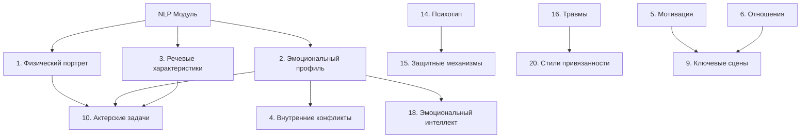

# Система модулей анализа персонажей

## 🧠 Общая концепция

Система состоит из **20 модулей анализа**, разделенных на две категории:
- **Базовые модули (1-13)** - основанные на театральной методологии Станиславского
- **Психологические модули (14-20)** - основанные на современных психологических теориях

Каждый модуль представляет собой структурированный чеклист с вопросами, ответами и рекомендациями для актера.

## 📋 Структура модуля

### Иерархия элементов
```
Модуль (Checklist)
├── Секция (Section) - тематический блок
│   ├── Подсекция (Subsection) - конкретная область
│   │   ├── Группа вопросов (QuestionGroup)
│   │   │   ├── Вопрос (Question)
│   │   │   │   ├── Ответ 1 (Answer)
│   │   │   │   ├── Ответ 2 (Answer)
│   │   │   │   └── ...
```

### Метаданные модуля
- **external_id** - уникальный идентификатор (например, "physical-portrait")
- **title** - название модуля
- **description** - описание назначения
- **icon** - эмодзи для UI
- **order_index** - порядок отображения
- **version** - версия модуля

## 🎭 Базовые модули (1-13)

### 1. Физический портрет персонажа
**Цель**: Создание детального описания внешности и физических проявлений

**Секции**:
- **Внешность и физические данные** - рост, телосложение, черты лица
- **Движения и манеры** - походка, жесты, осанка
- **Голос и речь** - тембр, дикция, интонации
- **Стиль и одежда** - предпочтения в одежде, аксессуары
- **Физические привычки** - тики, жесты, позы

**Критические зависимости**: NLP-модуль для извлечения описаний из текста

### 2. Эмоциональный профиль персонажа
**Цель**: Создание карты эмоциональной жизни персонажа

**Секции**:
- **Базовые эмоции** - доминирующие эмоциональные состояния
- **Эмоциональные триггеры** - что вызывает сильные реакции
- **Способы выражения эмоций** - как персонаж проявляет чувства
- **Эмоциональная регуляция** - как справляется с эмоциями
- **Эмоциональная история** - травмы, радостные события

**Критические зависимости**: 90% анализа основано на речи персонажа из NLP-модуля

### 3. Речевые характеристики
**Цель**: Создание речевого портрета персонажа

**Секции**:
- **Лексика и словарь** - используемые слова, жаргон, архаизмы
- **Синтаксис и грамматика** - структура предложений, ошибки
- **Прагматика** - цели речи, стратегии общения
- **Фонетика и просодия** - произношение, ритм, мелодика
- **Социолингвистика** - речь в разных ситуациях

**Критические зависимости**: 100% анализа зависит от качества извлечения речи

### 4. Внутренние конфликты
**Цель**: Карта психологических противоречий персонажа

**Секции**:
- **Психологические конфликты** - противоречия в мышлении
- **Эмоциональные конфликты** - борьба чувств
- **Поведенческие конфликты** - несоответствие действий и желаний
- **Социальные конфликты** - противоречия с обществом
- **Экзистенциальные конфликты** - вопросы смысла жизни

**Критические зависимости**: 80% анализа основано на эмоциональных данных из модуля 2

### 5. Мотивация и цели
**Цель**: Определение сверхзадачи и сквозного действия по Станиславскому

**Секции**:
- **Сверхзадача** - главная цель жизни персонажа
- **Сквозное действие** - основная линия поведения
- **Ближайшие цели** - задачи в конкретных сценах
- **Препятствия** - что мешает достижению целей
- **Мотивационная иерархия** - приоритеты персонажа

### 6. Отношения с персонажами
**Цель**: Анализ динамики взаимодействий

**Секции**:
- **Семейные отношения** - родители, дети, супруги
- **Романтические отношения** - любовь, страсть, ревность
- **Дружеские отношения** - близкие друзья, товарищи
- **Профессиональные отношения** - коллеги, начальники
- **Враждебные отношения** - конфликты, соперничество

### 7. Предыстория и биография
**Цель**: Жизненная история персонажа

**Секции**:
- **Детство и юность** - формирующие события
- **Образование и карьера** - профессиональный путь
- **Семейная история** - родители, предки
- **Ключевые события** - поворотные моменты жизни
- **Травматический опыт** - потери, неудачи, болезни

### 8. Социальный статус
**Цель**: Положение персонажа в обществе

**Секции**:
- **Экономическое положение** - доходы, собственность
- **Социальная принадлежность** - класс, сословие
- **Профессиональный статус** - должность, репутация
- **Культурный капитал** - образование, манеры
- **Политические взгляды** - убеждения, активность

### 9. Ключевые сцены
**Цель**: Анализ поворотных моментов

**Секции**:
- **Сцены конфликта** - открытые столкновения
- **Сцены откровения** - важные открытия
- **Сцены принятия решений** - выбор пути
- **Эмоциональные кульминации** - пики переживаний
- **Сцены трансформации** - изменения персонажа

### 10. Актерские задачи
**Цель**: Конкретные задания по методу Станиславского

**Секции**:
- **Физические задачи** - работа с телом
- **Эмоциональные задачи** - переживания
- **Речевые задачи** - работа с текстом
- **Взаимодействие** - работа с партнерами
- **Атмосфера** - создание настроения

### 11. Практические упражнения
**Цель**: Этюды для вживания в роль

**Секции**:
- **Этюды на память** - воспоминания персонажа
- **Этюды на воображение** - несыгранные сцены
- **Этюды на отношения** - работа с партнерами
- **Этюды на физическое самочувствие** - состояния тела
- **Этюды на предлагаемые обстоятельства** - условия жизни

### 12. Анализ подтекста
**Цель**: Выявление скрытых смыслов

**Секции**:
- **Невысказанные мысли** - что думает, но не говорит
- **Скрытые эмоции** - подавляемые чувства
- **Двойные смыслы** - многозначность реплик
- **Символические значения** - метафоры в поведении
- **Культурные коды** - скрытые отсылки

### 13. Темпо-ритм
**Цель**: Ритмические характеристики персонажа

**Секции**:
- **Внутренний ритм** - скорость мышления
- **Физический темп** - скорость движений
- **Речевой ритм** - темп и паузы в речи
- **Эмоциональные ритмы** - смена настроений
- **Ситуативные изменения** - как меняется в разных обстоятельствах

## 🧠 Психологические модули (14-20)

### 14. Психотип личности
**Основы**: MBTI, Big Five, типология Юнга, соционика

**Секции**:
- **MBTI типирование** - 16 типов личности
- **Big Five профиль** - пять факторов личности
- **Юнговские функции** - когнитивные предпочтения
- **Соционические отношения** - взаимодействие типов
- **Поведенческие предсказания** - типичные реакции

### 15. Защитные механизмы психики
**Основы**: Теория Анны Фрейд, современная психодинамика

**Секции**:
- **Примитивные защиты** - отрицание, проекция, расщепление
- **Невротические защиты** - вытеснение, регрессия, замещение
- **Зрелые защиты** - сублимация, юмор, альтруизм
- **Защиты в стрессе** - как реагирует на угрозы
- **Адаптивность защит** - эффективность копинга

### 16. Травмы и ПТСР
**Основы**: Теория травмы, ПТСР, комплексная травма

**Секции**:
- **Острые травмы** - единичные травматические события
- **Хронические травмы** - длительное воздействие
- **Травмы развития** - нарушения в детстве
- **Симптомы ПТСР** - флешбеки, избегание, гипервозбуждение
- **Копинг-стратегии** - способы справления с травмой

### 17. Архетипы (по Юнгу)
**Основы**: Коллективное бессознательное, архетипическая психология

**Секции**:
- **Основные архетипы** - Герой, Мудрец, Любовник, Правитель
- **Теневые архетипы** - Бунтарь, Шут, Сирота
- **Архетипы трансформации** - Маг, Творец, Искатель
- **Архетипические роли** - в разных ситуациях
- **Архетипическая динамика** - смена ролей

### 18. Эмоциональный интеллект
**Основы**: Модели Майера-Саловея, Гоулмана, Бар-Она

**Секции**:
- **Самосознание** - понимание своих эмоций
- **Саморегуляция** - управление эмоциями
- **Мотивация** - эмоциональные драйверы
- **Эмпатия** - понимание чужих эмоций
- **Социальные навыки** - управление отношениями

### 19. Когнитивные искажения
**Основы**: КПТ, теория двойственных процессов

**Секции**:
- **Искажения восприятия** - селективное внимание, конфирмация
- **Искажения атрибуции** - фундаментальная ошибка атрибуции
- **Эмоциональные искажения** - катастрофизация, персонализация
- **Искажения памяти** - ложные воспоминания, розовые очки
- **Социальные искажения** - стереотипы, предрассудки

### 20. Стили привязанности
**Основы**: Теория Боулби, стили привязанности взрослых

**Секции**:
- **Надежная привязанность** - здоровые отношения
- **Тревожная привязанность** - страх покинутости
- **Избегающая привязанность** - дистанцирование
- **Дезорганизованная привязанность** - хаотичные паттерны
- **Влияние на отношения** - как проявляется в поведении

## 🔗 Взаимосвязи модулей

### Критические зависимости


### Интеграционные связи
- **Физический ↔ Эмоциональный** - телесные проявления эмоций
- **Эмоциональный ↔ Речевой** - эмоциональная окраска речи
- **Психотип ↔ Защиты** - типичные защитные механизмы
- **Травмы ↔ Привязанность** - влияние травм на отношения

## 📊 Система оценки достоверности

Каждый ответ в модуле имеет градацию достоверности:

- 🔴 **Подтверждено текстом** (высокая достоверность)
  - Прямые цитаты из произведения
  - Явные описания автора
  - Реплики персонажа

- 🟡 **Логически выведено** (средняя достоверность)
  - Выводы на основе поведения
  - Анализ контекста ситуаций
  - Сравнение с другими персонажами

- 🟢 **Культурно типично** (низкая достоверность)
  - Типичное для эпохи/культуры
  - Социальные стереотипы
  - Исторический контекст

- 🔵 **Творчески дополнено** (гипотеза)
  - Актерская интерпретация
  - Режиссерское видение
  - Творческие домыслы

## 🎯 Практическое применение

### Для актера
1. **Последовательное заполнение** - от базовых к психологическим модулям
2. **Фокус на достоверности** - приоритет фактам из текста
3. **Практические упражнения** - использование рекомендаций
4. **Интеграция модулей** - создание целостного образа

### Для режиссера
1. **Анализ ансамбля** - сравнение персонажей
2. **Планирование репетиций** - на основе актерских задач
3. **Работа с конфликтами** - использование модуля 4
4. **Атмосфера спектакля** - через темпо-ритм

### Для педагога
1. **Структурированное обучение** - пошаговый анализ
2. **Научная обоснованность** - современные теории
3. **Практические навыки** - конкретные упражнения
4. **Оценка прогресса** - через заполненность модулей

---

*Система модулей создана для глубокого, научно обоснованного анализа персонажей с практической направленностью для актеров*
