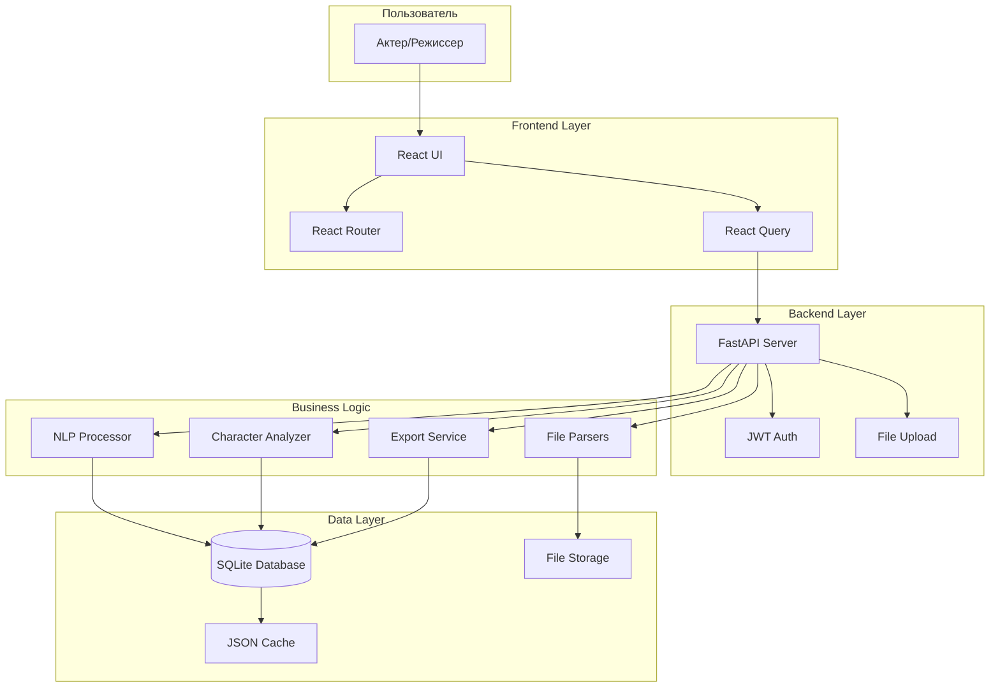
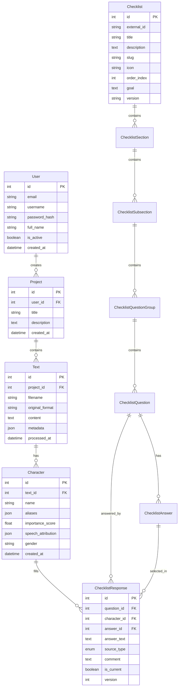
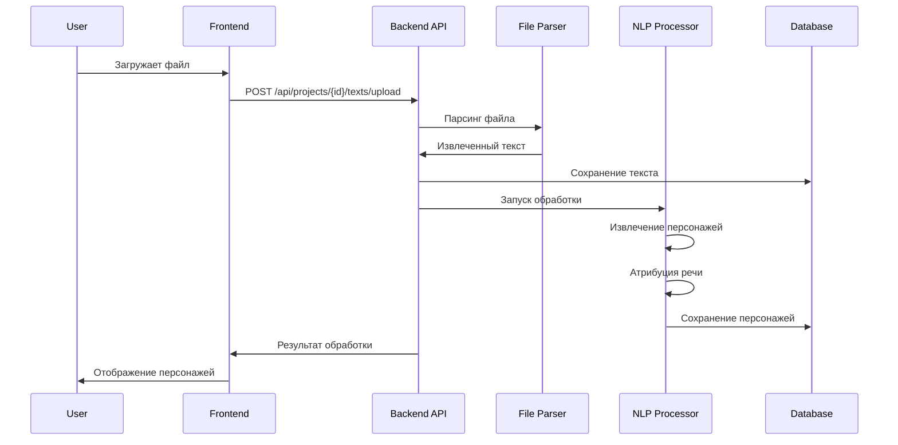
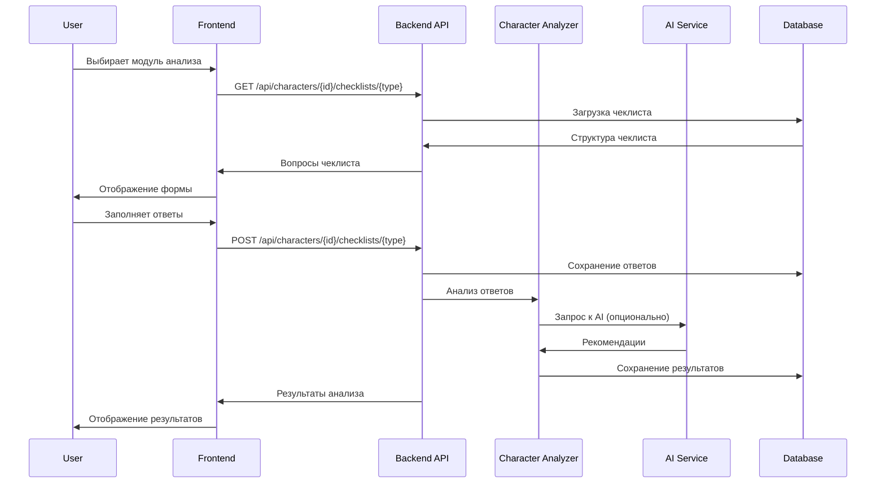

# Техническая архитектура системы

## 🏗️ Общая архитектура



## 🔧 Технический стек

### Frontend (React)
- **React 18** - основной UI фреймворк
- **TypeScript** - типизация и безопасность
- **Vite** - сборщик и dev-сервер
- **React Router** - маршрутизация
- **React Query** - управление состоянием и кэширование
- **React Hook Form** - работа с формами
- **Custom CSS** - стилизация без внешних библиотек

### Backend (Python)
- **FastAPI** - веб-фреймворк
- **Python 3.11+** - основной язык
- **SQLAlchemy** - ORM для работы с БД
- **Pydantic** - валидация данных
- **Uvicorn** - ASGI сервер
- **Python-multipart** - загрузка файлов

### База данных
- **SQLite** - локальная база данных
- **Alembic** - миграции схемы
- **JSON** - кэширование результатов

### NLP и обработка
- **spaCy** - основная NLP библиотека
- **PyPDF2** - парсинг PDF файлов
- **ebooklib** - парсинг EPUB
- **BeautifulSoup** - парсинг FB2/XML

## 📊 Архитектура данных

### Модель данных


### Файловая структура
```
role/
├── frontend/                    # React приложение
│   ├── src/
│   │   ├── components/          # React компоненты
│   │   │   ├── auth/           # Авторизация
│   │   │   ├── checklists/     # Система чеклистов
│   │   │   ├── projects/       # Управление проектами
│   │   │   └── common/         # Общие компоненты
│   │   ├── pages/              # Страницы приложения
│   │   ├── services/           # API клиенты
│   │   ├── contexts/           # React контексты
│   │   ├── hooks/              # Кастомные хуки
│   │   ├── types/              # TypeScript типы
│   │   └── utils/              # Утилиты
│   ├── public/                 # Статические файлы
│   └── dist/                   # Собранное приложение
│
├── backend/                     # Python сервер
│   ├── app/
│   │   ├── main.py             # Точка входа FastAPI
│   │   ├── database/           # Модели и подключение к БД
│   │   │   ├── models/         # SQLAlchemy модели
│   │   │   └── crud/           # CRUD операции
│   │   ├── routers/            # API роутеры
│   │   ├── services/           # Бизнес-логика
│   │   │   ├── nlp/           # NLP обработка
│   │   │   ├── parsers/       # Парсеры файлов
│   │   │   └── export/        # Экспорт данных
│   │   ├── middleware/         # Middleware
│   │   ├── dependencies/       # Зависимости FastAPI
│   │   └── utils/              # Утилиты
│   ├── uploads/                # Загруженные файлы
│   ├── cache/                  # Кэш результатов
│   └── database.db             # SQLite база
│
├── memory-bank/                 # Банк знаний проекта
├── docs/                        # Документация
├── scripts/                     # Скрипты развертывания
└── shared/                      # Общие типы и утилиты
```

## 🔄 Потоки данных

### 1. Загрузка и обработка файла


### 2. Анализ персонажа


## 🔐 Безопасность

### Аутентификация и авторизация
- **JWT токены** - Access (15 мин) + Refresh (7 дней)
- **bcrypt** - хеширование паролей с солью
- **Middleware** - проверка токенов на каждый запрос
- **CORS** - настроенный для production домена

### Защита данных
- **Row Level Security** - пользователи видят только свои данные
- **Валидация входных данных** - Pydantic схемы
- **Ограничение размера файлов** - максимум 100 МБ
- **Проверка типов файлов** - MIME-type validation

### Сетевая безопасность
- **HTTPS** - принудительное шифрование
- **Rate Limiting** - 100 запросов в минуту
- **Secure Headers** - CSP, HSTS, X-Frame-Options

## ⚡ Производительность

### Frontend оптимизации
- **Code Splitting** - разделение кода по роутам
- **Lazy Loading** - ленивая загрузка компонентов
- **React Query** - кэширование API запросов
- **Виртуализация** - для больших списков

### Backend оптимизации
- **Асинхронность** - FastAPI с async/await
- **Пулы соединений** - SQLAlchemy connection pooling
- **Кэширование** - JSON кэш для результатов NLP
- **Пагинация** - для больших наборов данных

### База данных
- **Индексы** - на часто запрашиваемые поля
- **Нормализация** - оптимальная структура таблиц
- **Batch операции** - для массовых вставок
- **Vacuum** - регулярная оптимизация SQLite

## 🔧 Развертывание

### Локальная разработка
```bash
# Backend
cd backend
python -m venv .venv
source .venv/bin/activate
pip install -r requirements.txt
uvicorn app.main:app --reload --port 8000

# Frontend
cd frontend
npm install
npm run dev
```

### Production развертывание
```bash
# Сборка frontend
cd frontend && npm run build

# Запуск через PM2
pm2 start ecosystem.config.js

# Nginx конфигурация
# Frontend: статические файлы
# Backend: reverse proxy на :8000
```

### Docker (планируется)
```dockerfile
# Multi-stage build
FROM node:18 AS frontend-build
FROM python:3.11 AS backend-build
FROM nginx:alpine AS production
```

## 📊 Мониторинг

### Логирование
- **Структурированные логи** - JSON формат
- **Уровни логирования** - DEBUG, INFO, WARNING, ERROR
- **Ротация логов** - по размеру и времени
- **Централизованное логирование** - все компоненты в одном месте

### Метрики
- **Время ответа API** - средние и перцентили
- **Использование памяти** - backend процессы
- **Размер базы данных** - рост во времени
- **Ошибки** - частота и типы

### Мониторинг здоровья
- **Health checks** - `/health` эндпоинт
- **Database connectivity** - проверка подключения к БД
- **File system** - доступность директорий
- **Memory usage** - использование памяти

## 🔄 Интеграции

### Внешние сервисы
- **AI сервисы** - Yandex GPT, OpenAI (опционально)
- **Email** - уведомления (планируется)
- **Cloud Storage** - резервное копирование (планируется)

### API интеграции
- **RESTful API** - основной интерфейс
- **WebSocket** - real-time обновления (планируется)
- **Webhooks** - интеграция с внешними системами (планируется)

## 🚀 Масштабирование

### Горизонтальное масштабирование
- **Микросервисная архитектура** - разделение на сервисы
- **Load Balancer** - распределение нагрузки
- **Database sharding** - разделение данных

### Вертикальное масштабирование
- **CPU оптимизация** - многопоточность для NLP
- **Memory optimization** - эффективное использование памяти
- **SSD storage** - быстрый доступ к данным

---

*Архитектура спроектирована для надежности, производительности и масштабируемости*